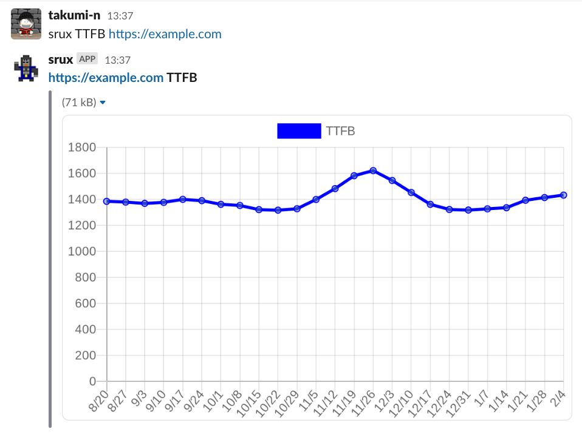

# Srux

Srux is a chatbot that allows you to see CrUX data for your site from Slack

## Usage

```
srux <metric> [url]
```

|arg|description|
|-|-|
|`<metric>`|Required. LCP or CLS or FID or TTFB or INP or FCP|
|`[url]`|Optional. URL of the page where you want to see CrUX data. If omitted, data for the entire origin|



### Examples

```
srux LCP https://example.com/hello
```

```
srux FID
```

## Installation

### Environment Variables

|Key|Value|
|-|-|
|SLACK_BOT_TOKEN|[Slack bot token](https://slack.dev/bolt-js/tutorial/getting-started#setting-up-your-project)|
|SLACK_SIGNING_SECRET|[Slack signing secret](https://slack.dev/bolt-js/tutorial/getting-started#setting-up-your-project)|
|CRUX_API_KEY|[CrUX API key](https://developer.chrome.com/docs/crux/api/#crux-api-key)|
|ORIGIN|Your site origin like `https://example.com`|
|SITE_NAME|Your site name|

### Start

```sh
$ yarn install
$ yarn start
```